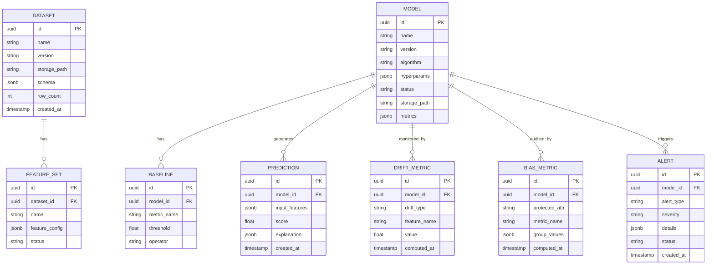

# Architecture Decision Records
## E-Commerce Fraud Detection MLOps Platform

## System Overview

### High-Level Architecture


---

## Domain-Specific Architecture

### ML Platform Component Architecture


---

## Technology Stack

### Stack Decision Matrix

| Layer | Technology | Version | Justification |
|-------|------------|---------|---------------|
| **Frontend** | React + TypeScript | 18.x | Component ecosystem, type safety |
| **Build Tool** | Vite | 5.x | Fast HMR, ESM-native |
| **UI Components** | Ant Design / Chakra | Latest | Enterprise-ready, accessible |
| **Charts** | Recharts / ECharts | Latest | Time-series, distribution plots |
| **Backend** | FastAPI | 0.109+ | Async, auto-docs, Pydantic v2 |
| **ML Framework** | Scikit-learn, XGBoost, PyTorch | Latest | Fraud detection algorithms |
| **Feature Engineering** | Pandas, Polars | Latest | Fast data transformation |
| **Drift Detection** | Evidently, Alibi-Detect | Latest | Statistical drift algorithms |
| **Explainability** | SHAP, LIME | Latest | Model explanation |
| **Database** | PostgreSQL | 15+ | JSONB, full-text search |
| **Cache** | Redis | 7.x | Feature store, computed features |
| **Object Storage** | Azure Blob | - | Datasets, models, artifacts |
| **Queue** | Azure Service Bus | - | Async events, alerts |
| **Auth** | Azure AD B2C | - | Managed identity |
| **Secrets** | Azure Key Vault | - | API keys, credentials |
| **Monitoring** | App Insights | - | APM, logging, metrics |
| **IaC** | Terraform | 1.5+ | Azure resource provisioning |

---

## Service Architecture

### Service Boundaries

| Service | Responsibility | Tech | Database | Port |
|---------|----------------|------|----------|------|
| `api-gateway` | Routing, auth, rate limiting | FastAPI | - | 8000 |
| `data-service` | Dataset CRUD, versioning | FastAPI | PostgreSQL + Blob | 8001 |
| `feature-service` | Feature engineering pipeline | FastAPI + Celery | Redis | 8002 |
| `training-service` | Training jobs, hyperparams | FastAPI + Azure ML | PostgreSQL | 8003 |
| `model-service` | Model registry, promotion | FastAPI | PostgreSQL + Blob | 8004 |
| `inference-service` | Real-time predictions | FastAPI | Redis (features) | 8005 |
| `monitoring-service` | Drift, bias, baselines | FastAPI | PostgreSQL | 8006 |
| `alert-service` | Alert rules, notifications | FastAPI + Service Bus | PostgreSQL | 8007 |
| `retraining-service` | Automated retraining workflow | FastAPI + Celery | PostgreSQL | 8008 |

### Service Communication


---

## Data Architecture

### Database Schema (Logical)



### Storage Strategy

| Data Type | Storage | Format | Retention |
|-----------|---------|--------|-----------|
| Datasets (raw) | Blob Storage | Parquet/CSV | 2 years |
| Trained Models | Blob Storage | Pickle/ONNX | Forever |
| Feature Cache | Redis | JSON | 24 hours |
| Metadata | PostgreSQL | Relational | Forever |
| Predictions | PostgreSQL | JSONB | 90 days |
| Drift Metrics | PostgreSQL | Time-series | 1 year |
| Audit Logs | Blob Storage | JSON Lines | 7 years |

---

## Architecture Decision Records

### ADR-001: Modular Monolith vs Microservices

**Status**: ACCEPTED  
**Context**: Team size is small, need fast delivery in 3 months  
**Decision**: Start with **modular monolith** with clear service boundaries, deploy as single FastAPI app initially  
**Consequences**:
- ✅ Single deployment, simpler ops
- ✅ Easy refactoring across modules
- ✅ Can extract to microservices later
- ⚠️ Must enforce module boundaries via code review
- ⚠️ Shared database initially

### ADR-002: Feature Store Implementation

**Status**: ACCEPTED  
**Context**: Need fast feature access for training and inference (<10ms)  
**Decision**: **Redis** for online feature store, **PostgreSQL/Blob** for offline feature store  
**Consequences**:
- ✅ Redis provides <1ms read latency
- ✅ No additional infrastructure (Feast, Tecton)
- ⚠️ Manual feature consistency management
- ⚠️ Limited to simpler feature types

### ADR-003: Training Infrastructure

**Status**: ACCEPTED  
**Context**: Need scalable training without managing GPU clusters  
**Decision**: **Azure ML Compute** for training jobs, triggered via SDK  
**Consequences**:
- ✅ Auto-scaling compute clusters
- ✅ Built-in experiment tracking
- ✅ Cost optimization (spot instances)
- ⚠️ Azure lock-in for training
- ⚠️ Learning curve for Azure ML SDK

### ADR-004: Drift Detection Strategy

**Status**: ACCEPTED  
**Context**: Need real-time and batch drift detection  
**Decision**: **Evidently AI** library for drift calculations, custom dashboard  
**Consequences**:
- ✅ Open-source, well-maintained
- ✅ Supports PSI, KS, Chi-Square
- ✅ Concept drift via performance monitoring
- ⚠️ Must run as scheduled jobs
- ⚠️ Integration effort with custom UI

### ADR-005: Bias Detection Approach

**Status**: ACCEPTED  
**Context**: Need fairness metrics for protected attributes (gender, age)  
**Decision**: **Fairlearn** library for bias metrics, custom alerts  
**Consequences**:
- ✅ Microsoft-backed, well-documented
- ✅ Supports demographic parity, equalized odds
- ✅ Integrates with scikit-learn
- ⚠️ Additional dependency
- ⚠️ Must collect protected attribute data

### ADR-006: Retraining Orchestration

**Status**: ACCEPTED  
**Context**: Need automated retraining triggered by alerts  
**Decision**: **Celery + Redis** for task queue, orchestrate training workflow  
**Consequences**:
- ✅ Python-native, well-understood
- ✅ Retry logic, scheduling built-in
- ✅ Can scale workers horizontally
- ⚠️ Redis as single point of failure
- ⚠️ Monitoring Celery adds complexity

### ADR-007: API Design

**Status**: ACCEPTED  
**Context**: Need clear API contracts for frontend and future integrations  
**Decision**: **REST** with OpenAPI 3.0, versioned endpoints `/api/v1/`  
**Consequences**:
- ✅ Auto-generated docs from FastAPI
- ✅ SDK generation possible
- ✅ Clear versioning strategy
- ⚠️ May need GraphQL for complex queries later

### ADR-008: Model Serving Strategy *(Added from Review)*

**Status**: ACCEPTED  
**Context**: Need <100ms inference latency for real-time fraud detection  
**Decision**: **FastAPI + ONNX Runtime** for model serving  
**Consequences**:
- ✅ ONNX provides 2-5x faster inference than native sklearn/XGBoost
- ✅ Single serving infrastructure (no Seldon/KServe complexity)
- ✅ Cross-platform compatibility
- ⚠️ Must convert models to ONNX after training
- ⚠️ Some model types may not convert cleanly

**Implementation**:
```python
# Model conversion after training
import onnxmltools
onnx_model = onnxmltools.convert_xgboost(model, initial_types=initial_types)

# Inference with ONNX Runtime
import onnxruntime as ort
session = ort.InferenceSession("model.onnx")
predictions = session.run(None, {"input": features})
```

### ADR-009: Feature Versioning *(Added from Review)*

**Status**: ACCEPTED  
**Context**: Training-serving skew can occur if features change between training and inference  
**Decision**: **Immutable Feature Sets** with version tracking  
**Consequences**:
- ✅ Each model stores `feature_set_id` for exact reproducibility
- ✅ Feature schema stored with version
- ✅ Inference loads correct feature computation logic per model
- ⚠️ Storage overhead for multiple feature set versions
- ⚠️ Must maintain backward-compatible feature computation

**Schema Addition**:
```sql
ALTER TABLE feature_sets ADD COLUMN version VARCHAR(50) NOT NULL DEFAULT '1.0';
ALTER TABLE feature_sets ADD COLUMN schema_hash VARCHAR(64); -- SHA-256 of schema
ALTER TABLE ml_models ADD COLUMN feature_set_version VARCHAR(50);
```

### ADR-010: Model Artifact Format *(Added from Review)*

**Status**: ACCEPTED  
**Context**: Need consistent model storage, versioning, and serving  
**Decision**: **Dual-format storage** - ONNX for inference, Original for debugging  
**Consequences**:
- ✅ ONNX for fast production inference
- ✅ Original pickle/joblib for debugging and analysis
- ✅ MLflow format for experiment tracking metadata
- ⚠️ Larger storage footprint (2 files per model)
- ⚠️ Must validate ONNX conversion accuracy

**Storage Structure**:
```
models/{model_id}/
├── model.onnx           # Production inference
├── model.pkl            # Original for debugging
├── metadata.json        # Hyperparams, metrics, features
├── checksum.sha256      # Integrity verification
└── mlflow/              # MLflow tracking files
```

### ADR-011: Experiment Tracking *(Added from Review)*

**Status**: ACCEPTED  
**Context**: Need to compare multiple training runs and track experiments  
**Decision**: **Azure ML Experiment Tracking** (built-in with Azure ML Compute)  
**Consequences**:
- ✅ Already using Azure ML for training, no additional setup
- ✅ Tracks hyperparameters, metrics, artifacts automatically
- ✅ Comparison UI built-in
- ⚠️ Vendor lock-in to Azure
- ⚠️ Alternative: MLflow can be self-hosted if needed

### ADR-012: Imbalanced Data Handling *(Added from Review)*

**Status**: ACCEPTED  
**Context**: Fraud detection datasets are highly imbalanced (1-5% fraud)  
**Decision**: **Class weights as default**, with optional SMOTE  
**Consequences**:
- ✅ Class weights (scale_pos_weight) are fast and effective
- ✅ SMOTE available as configuration option for experimentation
- ✅ No data leakage risk when done correctly
- ⚠️ SMOTE increases training data size and time
- ⚠️ User must choose strategy consciously

**Configuration**:
```python
class TrainingConfig:
    imbalanced_strategy: Literal["class_weight", "smote", "undersample"] = "class_weight"
    smote_ratio: float = 0.5  # Target minority ratio if SMOTE
```

---

## Scalability Strategy

### Component Scaling

| Component | Scaling Trigger | Strategy |
|-----------|-----------------|----------|
| FastAPI | CPU > 70% | Horizontal (Container Apps) |
| Training Jobs | Job queue depth | Azure ML auto-scale |
| Feature Service | Request latency > 50ms | Horizontal + Redis cluster |
| PostgreSQL | Connections > 80% | PgBouncer + Read replicas |
| Redis | Memory > 80% | Cluster mode |

### Cost Projections (Monthly)

| Scale | Users | Models | Predictions/day | Est. Cost |
|-------|-------|--------|-----------------|-----------|
| MVP | 10 | 5 | 10K | $500-800 |
| Growth | 50 | 20 | 100K | $1,500-2,500 |
| Scale | 200 | 100 | 1M | $5,000-10,000 |

---

## Resilience Patterns

### Failure Scenarios

| Failure | Detection | Response | Recovery |
|---------|-----------|----------|----------|
| DB connection lost | Health check | Return cached data | Auto-reconnect |
| Training job fails | Job status | Alert, retry once | Manual intervention |
| Redis down | Circuit breaker | Compute features on-demand | Auto-reconnect |
| Drift service slow | Timeout | Skip non-critical metrics | Catch up next cycle |
| Model file corrupt | Checksum validation | Rollback to previous version | Re-train |

### SLA Targets

| Metric | MVP Target | Growth Target |
|--------|------------|---------------|
| Availability | 99.5% | 99.9% |
| API Latency (p99) | < 500ms | < 200ms |
| Inference Latency (p99) | < 100ms | < 50ms |
| Training Job Start | < 5 min | < 2 min |
| Alert Delivery | < 5 min | < 1 min |

---

## Security Architecture

### Security Layers

```
┌─────────────────────────────────────────────────────────────┐
│                    Azure Front Door                          │
│                 (DDoS Protection, WAF)                       │
└─────────────────────────────────────────────────────────────┘
                              │
┌─────────────────────────────────────────────────────────────┐
│                    API Management                            │
│          (Rate Limiting, JWT Validation, CORS)               │
└─────────────────────────────────────────────────────────────┘
                              │
┌─────────────────────────────────────────────────────────────┐
│                    Application Layer                         │
│    (Input Validation, RBAC, Audit Logging, OWASP)           │
└─────────────────────────────────────────────────────────────┘
                              │
┌─────────────────────────────────────────────────────────────┐
│                    Data Layer                                │
│  (Encryption at Rest, TLS in Transit, Row-Level Security)   │
└─────────────────────────────────────────────────────────────┘
```

### Authentication Flow


---

## Deployment Architecture

### Environment Strategy

| Environment | Purpose | Infra | Data |
|-------------|---------|-------|------|
| `dev` | Feature development | Minimal (1 replica) | Synthetic |
| `staging` | Integration testing | Production-like | Anonymized |
| `prod` | Production | Full HA | Real |

### Infrastructure as Code

```
terraform/
├── modules/
│   ├── networking/     # VNet, Subnets, NSGs
│   ├── compute/        # Container Apps, Azure ML
│   ├── database/       # PostgreSQL, Redis
│   ├── storage/        # Blob, Containers
│   ├── security/       # Key Vault, AD B2C
│   └── monitoring/     # App Insights, Alerts
├── environments/
│   ├── dev.tfvars
│   ├── staging.tfvars
│   └── prod.tfvars
└── main.tf
```

### CI/CD Pipeline


---

## Integration Points

### External Systems

| System | Direction | Protocol | Auth | Purpose |
|--------|-----------|----------|------|---------|
| E-commerce Platform | Inbound | REST/Webhook | API Key | Transaction data |
| Labeling Service | Inbound | REST | mTLS | Fraud labels |
| Email Service (SendGrid) | Outbound | REST | API Key | Alert notifications |
| Slack | Outbound | Webhook | OAuth | Team alerts |

### Internal APIs

| API | Consumers | Rate Limit | Auth |
|-----|-----------|------------|------|
| `/api/v1/datasets` | UI, Training | 100/min | JWT |
| `/api/v1/models` | UI, Inference | 100/min | JWT |
| `/api/v1/predict` | E-commerce | 1000/min | API Key |
| `/api/v1/monitoring` | UI, Alerts | 100/min | JWT |

---

## Open Questions for Tech Lead

1. **Celery vs Azure Functions**: Should we use Azure Functions instead of Celery for background jobs?
2. **Model Serving**: FastAPI inference or dedicated model serving (Seldon, KServe)?
3. **Feature Computation**: Real-time computation vs pre-computed batch features?
4. **WebSocket**: Real-time dashboard updates via WebSocket or polling?

---

## Directory Structure (Proposed)

```
shadow-hubble/
├── frontend/                    # React + TypeScript
│   ├── src/
│   │   ├── components/
│   │   ├── pages/
│   │   ├── hooks/
│   │   ├── services/           # API clients
│   │   └── types/
│   └── package.json
│
├── backend/                     # Python + FastAPI
│   ├── app/
│   │   ├── api/                # Route handlers
│   │   │   ├── v1/
│   │   │   │   ├── datasets.py
│   │   │   │   ├── models.py
│   │   │   │   ├── training.py
│   │   │   │   ├── inference.py
│   │   │   │   ├── monitoring.py
│   │   │   │   └── alerts.py
│   │   ├── core/               # Config, security
│   │   ├── models/             # SQLAlchemy models
│   │   ├── schemas/            # Pydantic schemas
│   │   ├── services/           # Business logic
│   │   │   ├── data_service.py
│   │   │   ├── feature_service.py
│   │   │   ├── training_service.py
│   │   │   ├── model_service.py
│   │   │   ├── inference_service.py
│   │   │   ├── drift_service.py
│   │   │   ├── bias_service.py
│   │   │   └── alert_service.py
│   │   └── workers/            # Celery tasks
│   ├── tests/
│   ├── alembic/                # Migrations
│   └── pyproject.toml
│
├── ml/                          # ML-specific code
│   ├── algorithms/              # Model implementations
│   ├── features/                # Feature engineering
│   ├── drift/                   # Drift detection
│   ├── bias/                    # Bias detection
│   └── explainability/          # SHAP/LIME
│
├── infrastructure/              # Terraform
│   ├── modules/
│   └── environments/
│
├── .github/
│   └── workflows/               # CI/CD
│
└── docs/                        # Documentation
```

---

*Document prepared by: Enterprise Architect Persona*  
*Ready for handoff to: Tech Lead*
