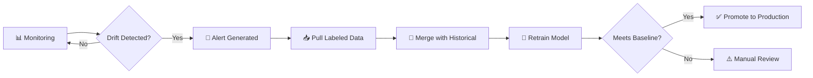

# Business Strategy Document
## E-Commerce Fraud Detection MLOps Platform (Shadow Hubble)

## Executive Summary

An internal ML lifecycle platform for our e-commerce organization to detect, monitor, and respond to fraud in real-time. The platform enables continuous model improvement through **automated retraining pipelines**, **streaming data integration**, and **UI-driven model training**—transforming fraud detection from a static deployment to a living, adaptive system.

---

## Problem Statement

### The Problem
**Our e-commerce platform processes millions of transactions but lacks an integrated system to train, monitor, retrain, and explain fraud detection models—leading to delayed fraud response, model staleness, and inability to leverage new labeled data.**

### Who Experiences This Problem

| Segment | Team Size | Pain Level (1-10) | Current Solution |
|---------|-----------|-------------------|------------------|
| **Fraud Analysts** | 5-10 | 9 | Manual review, rule-based systems |
| **Data Scientists** | 3-5 | 8 | Jupyter notebooks, manual deployments |
| **ML Engineers** | 2-3 | 8 | Custom scripts, no unified platform |
| **Business/Finance** | 5+ | 7 | Delayed fraud reports, revenue leakage |

### Quantified Impact

- **Fraud losses**: 0.5-2% of transaction volume (industry average)
- **Manual review time**: 20+ hours/week per analyst
- **Model staleness**: Current models not retrained for 6+ months
- **Missed opportunities**: Labeled streaming data not utilized for improvement
- **Detection delay**: Hours to days vs real-time response

---

## Core Use Case: E-Commerce Fraud Detection

### The Fraud Detection Pipeline

```
┌─────────────────────────────────────────────────────────────────────────────┐
│                           FRAUD DETECTION LIFECYCLE                          │
├─────────────────────────────────────────────────────────────────────────────┤
│                                                                              │
│  📥 DATA INGESTION                                                           │
│  ├── Training Data: 1 Lakh rows (initial labeled dataset)                   │
│  └── Streaming Data: 10 Lakh transactions                                   │
│       └── 1 Lakh with actual fraud labels (feedback loop)                   │
│                                                                              │
│  ⚙️ FEATURE ENGINEERING (Backend)                                            │
│  ├── Transaction features (amount, frequency, velocity)                     │
│  ├── User behavior features (device, location, history)                     │
│  ├── Temporal features (time of day, day patterns)                          │
│  └── Graph features (merchant relationships, network analysis)              │
│                                                                              │
│  🎯 MODEL TRAINING (UI-Driven)                                               │
│  ├── Select training dataset from Data Registry                             │
│  ├── Choose algorithm (Isolation Forest, XGBoost, Neural Net)               │
│  ├── Configure hyperparameters                                              │
│  ├── Set baseline metrics (precision, recall, F1, AUC-ROC)                  │
│  └── View training progress and results                                      │
│                                                                              │
│  📊 MONITORING & DRIFT DETECTION                                             │
│  ├── Real-time prediction monitoring                                         │
│  ├── Data drift detection (feature distribution shifts)                     │
│  ├── Concept drift (fraud pattern changes)                                  │
│  ├── Performance degradation alerts                                          │
│  └── Baseline comparison dashboards                                          │
│                                                                              │
│  🔄 AUTOMATED RETRAINING (Alert-Triggered)                                   │
│  ├── Alert triggers retraining workflow                                      │
│  ├── Pull labeled data from Data Registry                                   │
│  ├── Merge with historical training data                                     │
│  ├── Retrain model with new data                                            │
│  ├── Compare against baseline metrics                                        │
│  └── Promote or rollback based on performance                               │
│                                                                              │
└─────────────────────────────────────────────────────────────────────────────┘
```

---

## Key System Capabilities

### 1. Data Registry & Streaming Integration

| Feature | Description |
|---------|-------------|
| **Dataset Catalog** | Browse, search, version all training datasets |
| **Streaming Ingestion** | Connect to transaction stream, buffer data |
| **Label Collection** | Capture actual fraud/non-fraud labels over time |
| **Auto-Aggregation** | Pull labeled subset (1L out of 10L) for retraining |
| **Data Validation** | Schema enforcement, quality checks |

### 2. UI-Based Model Training

| Feature | Description |
|---------|-------------|
| **Dataset Selection** | Pick datasets from Data Registry |
| **Algorithm Library** | Pre-configured fraud detection algorithms |
| **Hyperparameter UI** | Visual configuration, presets for beginners |
| **Training Monitor** | Real-time loss curves, metrics |
| **Baseline Definition** | Set expected performance thresholds |
| **Version Control** | Each training run versioned automatically |

### 3. Feature Engineering Pipeline (Backend)

| Component | Processing |
|-----------|------------|
| **Raw Features** | Transaction amount, timestamp, merchant ID, user ID |
| **Derived Features** | Transaction velocity, spending deviation, session patterns |
| **Aggregations** | Rolling averages, counts, sums over time windows |
| **Embeddings** | User/merchant embeddings for neural models |
| **Feature Store** | Cached features for fast inference and training |

### 4. Monitoring & Baseline Metrics

| Metric Type | Examples |
|-------------|----------|
| **Model Performance** | Precision, Recall, F1-Score, AUC-ROC |
| **Business Metrics** | Fraud detection rate, false positive rate, $$ saved |
| **Data Quality** | Missing values, distribution stats, outliers |
| **Drift Indicators** | PSI (Population Stability Index), KS-statistic |
| **Latency Metrics** | Inference time, p50/p95/p99 |

### 5. Alert-Triggered Retraining



---

## Business Model

### Value Proposition (Internal)

**"From static fraud models to adaptive intelligence—automatically retrain when patterns shift, leverage every labeled transaction, and never let fraud outpace your defenses."**

### ROI Calculation

| Metric | Before Platform | After Platform | Improvement |
|--------|-----------------|----------------|-------------|
| Fraud Detection Rate | 75% | 92% | +17% |
| False Positive Rate | 8% | 3% | -5% |
| Model Freshness | 6 months | Weekly | 24x faster |
| Time to New Model | 2 weeks | 2 hours | 84x faster |
| Manual Review Time | 20 hrs/week | 8 hrs/week | 60% reduction |

### Cost-Benefit Analysis

| Cost Category | Estimate |
|---------------|----------|
| **Development** (3 months) | Internal team time |
| **Infrastructure** (Azure) | ~$5K-10K/month |
| **Maintenance** | 0.5 FTE ongoing |
| **Total Year 1** | ~$150K fully loaded |

| Benefit Category | Estimate |
|------------------|----------|
| **Fraud Prevention** | +$500K-2M/year (reduced fraud) |
| **Analyst Efficiency** | +$100K/year (time savings) |
| **Faster Response** | Opportunity cost reduction |
| **Total Benefit** | $600K-2M/year |

**ROI: 4-13x return in Year 1**

---

## Technology Architecture Overview

### System Components

```
┌─────────────────────────────────────────────────────────────────────────┐
│                              FRONTEND (React + TypeScript)               │
│  ┌──────────┐ ┌──────────┐ ┌──────────┐ ┌──────────┐ ┌──────────┐      │
│  │Dashboard │ │Model     │ │Training  │ │Data      │ │Alerts    │      │
│  │          │ │Registry  │ │UI        │ │Registry  │ │          │      │
│  └──────────┘ └──────────┘ └──────────┘ └──────────┘ └──────────┘      │
└─────────────────────────────────────────────────────────────────────────┘
                                    │
                                    ▼
┌─────────────────────────────────────────────────────────────────────────┐
│                              BACKEND (FastAPI + Python)                  │
│  ┌──────────────┐ ┌──────────────┐ ┌──────────────┐ ┌──────────────┐   │
│  │Feature       │ │Training      │ │Inference     │ │Monitoring    │   │
│  │Engineering   │ │Pipeline      │ │Service       │ │Service       │   │
│  │Service       │ │Service       │ │              │ │              │   │
│  └──────────────┘ └──────────────┘ └──────────────┘ └──────────────┘   │
└─────────────────────────────────────────────────────────────────────────┘
                                    │
                                    ▼
┌─────────────────────────────────────────────────────────────────────────┐
│                              DATA LAYER (Azure)                          │
│  ┌──────────────┐ ┌──────────────┐ ┌──────────────┐ ┌──────────────┐   │
│  │PostgreSQL    │ │Blob Storage  │ │Redis Cache   │ │Service Bus   │   │
│  │(Metadata)    │ │(Datasets/    │ │(Features)    │ │(Events)      │   │
│  │              │ │Models)       │ │              │ │              │   │
│  └──────────────┘ └──────────────┘ └──────────────┘ └──────────────┘   │
└─────────────────────────────────────────────────────────────────────────┘
```

### Key Data Flows

1. **Training Flow**: Data Registry → Feature Engineering → Training Service → Model Registry
2. **Inference Flow**: Transaction → Feature Engineering → Inference Service → Prediction
3. **Retraining Flow**: Alert → Pull Labels → Merge Data → Retrain → Validate → Deploy

---

## Success Metrics

### Primary KPIs (3-Month MVP)

| Metric | Target |
|--------|--------|
| Fraud Detection Rate | ≥90% |
| False Positive Rate | ≤5% |
| Model Retraining Time | <2 hours |
| Mean Time to Detection (MTTD) | <15 minutes |
| Platform Uptime | 99.5% |

### Secondary Metrics

| Metric | Target |
|--------|--------|
| User Adoption | 100% of fraud team |
| Training Jobs/Week | 5+ |
| Datasets in Registry | 20+ |
| Alert Response Time | <1 hour |

---

## Risk Assessment

| Risk | Probability | Impact | Mitigation |
|------|-------------|--------|------------|
| **Data Quality Issues** | High | High | Automated validation, data quality dashboards |
| **Model Performance Degradation** | Medium | High | Automated retraining, baseline monitoring |
| **Integration Complexity** | Medium | Medium | Phased rollout, mock data first |
| **Team Adoption** | Low | Medium | Training sessions, intuitive UI |
| **Latency in Real-time** | Medium | High | Redis caching, async processing |

---

## Timeline (3 Months)

### Month 1: Foundation
- [ ] Data Registry with dataset upload/versioning
- [ ] Basic Model Registry (list, version, status)
- [ ] Feature Engineering pipeline (core features)
- [ ] Backend API structure

### Month 2: Training & Monitoring
- [ ] UI-based Training interface
- [ ] Baseline metrics configuration
- [ ] Drift detection algorithms
- [ ] Alert system with notifications

### Month 3: Retraining & Polish
- [ ] Alert-triggered retraining pipeline
- [ ] Streaming data integration
- [ ] Dashboard with key metrics
- [ ] Testing, bug fixes, deployment

---

## Feature Pillars (Revised)

```
┌─────────────────────────────────────────────────────────────────────────┐
│                    E-COMMERCE FRAUD DETECTION PLATFORM                   │
├──────────────┬──────────────┬───────────────┬───────────────────────────┤
│   DATA       │   TRAINING   │   MONITORING  │   AUTOMATION              │
│ ────────────  │ ────────────  │ ─────────────  │ ────────────────────────  │
│ • Data Catalog│ • UI Training│ • Drift Detect│ • Alert-Triggered Retrain│
│ • Streaming   │ • Algorithm  │ • Baseline    │ • Auto Label Pull        │
│   Ingestion   │   Library    │   Comparison  │ • Model Promotion        │
│ • Label       │ • Hyperparam │ • Performance │ • Rollback on Failure    │
│   Collection  │   Config     │   Dashboards  │                          │
│ • Feature     │ • Version    │ • Anomaly     │                          │
│   Store       │   Control    │   Detection   │                          │
└──────────────┴──────────────┴───────────────┴───────────────────────────┘
```

---

## Recommendations

### Go/No-Go Decision

**✅ RECOMMENDED - PROCEED**

**Reasoning**:
1. **Clear ROI**: 4-13x return through reduced fraud
2. **Feasible Timeline**: 3 months is achievable with focused scope
3. **Team Readiness**: Sufficient budget and team
4. **Strategic Value**: Transforms fraud detection capability
5. **Future-Proof**: Continuous learning beats static models

### Critical Success Factors

1. **Feature Engineering Quality** - 80% of model performance
2. **Retraining Pipeline Reliability** - Core differentiator
3. **UI Usability** - Adoption depends on ease of use
4. **Real-time Latency** - <100ms inference for checkout flow
5. **Data Quality Gates** - Garbage in = garbage out

### Immediate Next Steps for Product Manager

1. **Map User Journeys**: Fraud Analyst, Data Scientist, ML Engineer workflows
2. **Define MVP Scope**: MoSCoW prioritization within 3-month constraint
3. **Feature Engineering Spec**: Document required features with Data Scientists
4. **UI Wireframes**: Core screens (Training, Registry, Monitoring)
5. **Integration Points**: E-commerce platform data sources

---

## Appendix: Original Figma Design Analysis

### Current Features (to enhance)
- Model Registry with versioning ✓
- Alerts with expected vs actual ✓
- Data Registry (basic) ✓

### Missing Features (to add)
- UI-based Training ❌
- Feature Engineering visualization ❌
- Baseline metric configuration ❌
- Retraining workflow ❌
- Streaming data integration ❌

---

*Document prepared by: Chief Business Strategist Persona*  
*Ready for handoff to: Product Manager*
