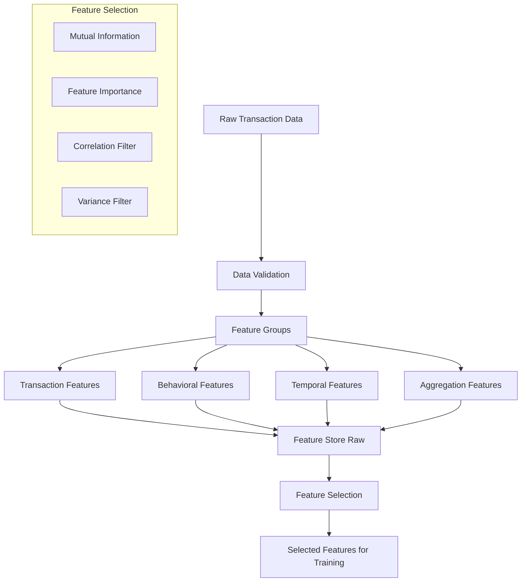

# Data Science Specifications
## E-Commerce Fraud Detection MLOps Platform

## Overview

This document specifies the ML algorithms, feature engineering pipelines, drift detection methods, bias metrics, and explainability approaches for the fraud detection platform.

---

## Feature Engineering Pipeline

### Feature Creation Process



### Feature Groups

#### 1. Transaction Features (Immediate)
| Feature Name | Description | Type | Formula |
|--------------|-------------|------|---------|
| `amount` | Transaction amount | Float | Raw value |
| `amount_log` | Log of amount | Float | log(amount + 1) |
| `amount_zscore` | Z-score of amount | Float | (amount - mean) / std |
| `is_round_amount` | Is amount rounded | Bool | amount % 100 == 0 |
| `is_high_value` | Above threshold | Bool | amount > 5000 |
| `merchant_category` | One-hot encoded | Categorical | Encoded |
| `payment_method` | One-hot encoded | Categorical | Encoded |
| `device_type` | Mobile/Web/App | Categorical | Encoded |
| `is_international` | Cross-border txn | Bool | Derived from location |

#### 2. Behavioral Features (User History)
| Feature Name | Description | Type | Window |
|--------------|-------------|------|--------|
| `user_total_txns_30d` | Transaction count | Int | 30 days |
| `user_avg_amount_30d` | Average spend | Float | 30 days |
| `user_std_amount_30d` | Spend volatility | Float | 30 days |
| `user_unique_merchants_30d` | Merchant diversity | Int | 30 days |
| `user_new_merchant` | First time at merchant | Bool | All history |
| `user_preferred_device` | Most used device | Categorical | 90 days |
| `user_location_entropy` | Location diversity | Float | 30 days |
| `user_days_since_last_txn` | Recency | Int | N/A |

#### 3. Temporal Features (Time-based)
| Feature Name | Description | Type | Formula |
|--------------|-------------|------|---------|
| `hour_of_day` | Hour (0-23) | Int | Extracted |
| `day_of_week` | Day (Mon=0, Sun=6) | Int | Extracted |
| `is_weekend` | Weekend flag | Bool | day_of_week >= 5 |
| `is_night` | Night hours (22-6) | Bool | Derived |
| `is_holiday` | National holiday | Bool | Calendar lookup |
| `days_since_account_created` | Account age | Int | Derived |
| `time_since_last_txn_hours` | Time gap | Float | Derived |

#### 4. Aggregation Features (Rolling Windows)
| Feature Name | Description | Windows |
|--------------|-------------|---------|
| `velocity_{window}` | Txn count in window | 1h, 6h, 24h, 7d |
| `amount_sum_{window}` | Total spend in window | 1h, 6h, 24h, 7d |
| `amount_max_{window}` | Max single txn | 24h, 7d |
| `unique_merchants_{window}` | Merchant count | 24h, 7d |
| `amount_ratio_to_avg_{window}` | Current / avg | 7d, 30d |
| `velocity_acceleration` | velocity_1h / velocity_24h | Derived |

### Total Features: ~50-60 raw features

---

## Feature Selection (Information Gain)

> [!IMPORTANT]
> To avoid overfitting with too many features, we implement a **multi-stage feature selection pipeline**.

### Feature Selection Pipeline

```python
# Feature Selection Approach
class FeatureSelector:
    """
    Multi-stage feature selection to reduce dimensionality
    and select most informative features for fraud detection.
    """
    
    def __init__(self, max_features: int = 30):
        self.max_features = max_features
        self.selected_features = []
    
    def fit(self, X: pd.DataFrame, y: pd.Series):
        # Stage 1: Remove low variance features
        variance_selector = VarianceThreshold(threshold=0.01)
        X_var = variance_selector.fit_transform(X)
        
        # Stage 2: Remove highly correlated features
        X_uncorr = self._remove_correlated(X_var, threshold=0.95)
        
        # Stage 3: Mutual Information (Information Gain)
        mi_scores = mutual_info_classif(X_uncorr, y, random_state=42)
        mi_ranking = pd.Series(mi_scores, index=X_uncorr.columns).sort_values(descending=True)
        
        # Stage 4: Model-based importance (XGBoost)
        xgb = XGBClassifier(n_estimators=100, random_state=42)
        xgb.fit(X_uncorr, y)
        importance_ranking = pd.Series(
            xgb.feature_importances_, 
            index=X_uncorr.columns
        ).sort_values(descending=True)
        
        # Stage 5: Combine rankings (weighted average)
        combined_rank = (
            mi_ranking.rank(ascending=False) * 0.5 +
            importance_ranking.rank(ascending=False) * 0.5
        )
        
        # Select top N features
        self.selected_features = combined_rank.nsmallest(self.max_features).index.tolist()
        
        return self
    
    def transform(self, X: pd.DataFrame) -> pd.DataFrame:
        return X[self.selected_features]
```

### Feature Selection Algorithms

| Algorithm | Purpose | When to Use |
|-----------|---------|-------------|
| **Variance Threshold** | Remove constant features | Always (first filter) |
| **Correlation Filter** | Remove redundant features | Always (second filter) |
| **Mutual Information** | Measure information gain | Primary selection |
| **XGBoost Importance** | Model-based selection | Validation |
| **Recursive Feature Elimination (RFE)** | Iterative selection | When features < 100 |
| **SHAP Values** | Explain feature contribution | Post-training validation |

### Mutual Information (Information Gain) Details

```python
from sklearn.feature_selection import mutual_info_classif

def calculate_information_gain(X: pd.DataFrame, y: pd.Series) -> pd.DataFrame:
    """
    Calculate Mutual Information (Information Gain) for each feature.
    
    MI measures how much knowing X reduces uncertainty about Y.
    Higher MI = More informative feature for predicting fraud.
    """
    # For numerical features
    mi_scores = mutual_info_classif(
        X, y,
        discrete_features='auto',  # Auto-detect discrete features
        n_neighbors=5,             # For continuous features
        random_state=42
    )
    
    # Create ranking
    mi_df = pd.DataFrame({
        'feature': X.columns,
        'mutual_information': mi_scores,
        'rank': pd.Series(mi_scores).rank(ascending=False)
    }).sort_values('mutual_information', ascending=False)
    
    return mi_df

# Example output:
# | feature              | mutual_information | rank |
# |----------------------|-------------------|------|
# | amount_zscore        | 0.145             | 1    |
# | velocity_24h         | 0.132             | 2    |
# | is_new_device        | 0.098             | 3    |
# | user_days_since_last | 0.087             | 4    |
# | ...                  | ...               | ...  |
```

### Feature Selection Thresholds

| Stage | Threshold | Expected Reduction |
|-------|-----------|-------------------|
| Variance Filter | variance < 0.01 | 60 → 55 features |
| Correlation Filter | r > 0.95 | 55 → 45 features |
| MI + Importance | Top N | 45 → 25-30 features |
| **Final for Training** | - | **25-30 features** |

---

## Feature Creation Configuration (UI/API)

### Feature Configuration Schema

```python
# Pydantic schema for feature configuration
class FeatureConfig(BaseModel):
    """Configuration for feature engineering."""
    
    # Feature groups to enable
    transaction_features: bool = True
    behavioral_features: bool = True
    temporal_features: bool = True
    aggregation_features: bool = True
    
    # Aggregation windows
    aggregation_windows: List[str] = ["1h", "6h", "24h", "7d", "30d"]
    
    # Feature selection settings
    enable_feature_selection: bool = True
    selection_method: Literal["mutual_info", "xgboost", "combined"] = "combined"
    max_features: int = 30
    variance_threshold: float = 0.01
    correlation_threshold: float = 0.95
    
    # Output settings
    output_format: Literal["parquet", "csv"] = "parquet"
    cache_features: bool = True  # Store in Redis
```

### Feature Engineering API

```python
POST /api/v1/features/compute
{
    "dataset_id": "uuid",
    "config": {
        "transaction_features": true,
        "behavioral_features": true,
        "temporal_features": true,
        "aggregation_features": true,
        "aggregation_windows": ["1h", "24h", "7d"],
        "enable_feature_selection": true,
        "selection_method": "combined",
        "max_features": 30
    },
    "output_name": "fraud_features_v1"
}

Response: 202 Accepted
{
    "job_id": "uuid",
    "status": "PENDING",
    "stages": [
        {"stage": "data_load", "status": "pending"},
        {"stage": "feature_creation", "status": "pending"},
        {"stage": "feature_selection", "status": "pending"},
        {"stage": "output_save", "status": "pending"}
    ]
}
```

### Feature Job Progress

```python
GET /api/v1/features/jobs/{job_id}
{
    "job_id": "uuid",
    "status": "RUNNING",
    "progress": 0.65,
    "stages": [
        {"stage": "data_load", "status": "completed", "duration_s": 12},
        {"stage": "feature_creation", "status": "completed", "duration_s": 180},
        {"stage": "feature_selection", "status": "running", "progress": 0.5},
        {"stage": "output_save", "status": "pending"}
    ],
    "metrics": {
        "input_rows": 100000,
        "features_created": 58,
        "features_selected": null  # Pending
    }
}
```

---

## ML Algorithms

### Available Algorithms

| Algorithm | Use Case | Pros | Cons |
|-----------|----------|------|------|
| **Isolation Forest** | Unsupervised anomaly detection | No labels needed, fast | Lower precision |
| **XGBoost** | Supervised classification | High accuracy, interpretable | Needs labels |
| **LightGBM** | Large-scale classification | Fast, memory efficient | Similar to XGBoost |
| **Random Forest** | Ensemble classification | Robust, parallel | Slower inference |
| **Neural Network** | Complex patterns | Flexible, powerful | Black-box, data hungry |

### Default Hyperparameters

```python
ALGORITHM_DEFAULTS = {
    "isolation_forest": {
        "n_estimators": 200,
        "max_samples": 0.8,
        "contamination": 0.05,
        "random_state": 42
    },
    "xgboost": {
        "n_estimators": 200,
        "max_depth": 6,
        "learning_rate": 0.1,
        "min_child_weight": 3,
        "subsample": 0.8,
        "colsample_bytree": 0.8,
        "scale_pos_weight": 10,  # For class imbalance
        "random_state": 42
    },
    "lightgbm": {
        "n_estimators": 200,
        "max_depth": 6,
        "learning_rate": 0.1,
        "num_leaves": 31,
        "min_child_samples": 20,
        "subsample": 0.8,
        "colsample_bytree": 0.8,
        "class_weight": "balanced",
        "random_state": 42
    },
    "neural_network": {
        "hidden_layers": [64, 32, 16],
        "activation": "relu",
        "dropout": 0.3,
        "batch_size": 256,
        "epochs": 50,
        "early_stopping_patience": 5
    }
}
```

---

## Drift Detection

### Data Drift Detection

```python
class DataDriftDetector:
    """
    Detects distribution shifts in input features.
    """
    
    def __init__(self, reference_data: pd.DataFrame):
        self.reference = reference_data
        self.thresholds = {
            "psi": {"ok": 0.1, "warning": 0.2, "critical": 0.25},
            "ks": {"ok": 0.05, "warning": 0.1, "critical": 0.15}
        }
    
    def compute_psi(self, current: pd.Series, reference: pd.Series, bins: int = 10) -> float:
        """
        Population Stability Index (PSI)
        PSI < 0.1: No significant shift
        PSI 0.1-0.25: Moderate shift
        PSI > 0.25: Significant shift
        """
        ref_hist, bin_edges = np.histogram(reference, bins=bins)
        curr_hist, _ = np.histogram(current, bins=bin_edges)
        
        # Normalize
        ref_pct = ref_hist / len(reference) + 0.0001
        curr_pct = curr_hist / len(current) + 0.0001
        
        psi = np.sum((curr_pct - ref_pct) * np.log(curr_pct / ref_pct))
        return psi
    
    def compute_ks(self, current: pd.Series, reference: pd.Series) -> tuple:
        """
        Kolmogorov-Smirnov Test
        Returns (statistic, p_value)
        """
        statistic, p_value = ks_2samp(reference, current)
        return statistic, p_value
    
    def compute_chi_square(self, current: pd.Series, reference: pd.Series) -> tuple:
        """
        Chi-Square Test for categorical features
        """
        ref_counts = reference.value_counts(normalize=True)
        curr_counts = current.value_counts(normalize=True)
        
        # Align categories
        all_cats = set(ref_counts.index) | set(curr_counts.index)
        ref_aligned = ref_counts.reindex(all_cats, fill_value=0.001)
        curr_aligned = curr_counts.reindex(all_cats, fill_value=0.001)
        
        statistic, p_value = chisquare(curr_aligned, f_exp=ref_aligned)
        return statistic, p_value
```

### Concept Drift Detection

```python
class ConceptDriftDetector:
    """
    Detects changes in the relationship between features and target.
    Uses performance degradation as primary signal.
    """
    
    def __init__(self, baseline_metrics: dict):
        self.baseline = baseline_metrics
        self.performance_history = []
    
    def detect_drift(self, current_metrics: dict) -> dict:
        """
        Compare current model performance against baseline.
        """
        drift_signals = {}
        
        for metric_name, baseline_value in self.baseline.items():
            current_value = current_metrics.get(metric_name)
            if current_value is None:
                continue
            
            # Calculate degradation
            if metric_name in ["precision", "recall", "f1_score", "auc_roc"]:
                degradation = (baseline_value - current_value) / baseline_value
            else:  # For FPR, lower is better
                degradation = (current_value - baseline_value) / baseline_value
            
            status = "OK"
            if degradation > 0.05:
                status = "WARNING"
            if degradation > 0.10:
                status = "CRITICAL"
            
            drift_signals[metric_name] = {
                "baseline": baseline_value,
                "current": current_value,
                "degradation_pct": degradation * 100,
                "status": status
            }
        
        return drift_signals
```

### Drift Thresholds

| Metric | OK | Warning | Critical |
|--------|-----|---------|----------|
| **PSI** | < 0.10 | 0.10 - 0.25 | > 0.25 |
| **KS Statistic** | < 0.05 | 0.05 - 0.15 | > 0.15 |
| **Performance Drop** | < 5% | 5% - 10% | > 10% |

---

## Bias Detection (Fairlearn Integration)

### Protected Attributes Configuration

```python
PROTECTED_ATTRIBUTES = {
    "gender": {
        "column": "user_gender",
        "groups": ["male", "female", "other"],
        "thresholds": {
            "demographic_parity_diff": 0.10,
            "equalized_odds_diff": 0.10,
            "disparate_impact_min": 0.80
        }
    },
    "age_group": {
        "column": "user_age_bucket",
        "groups": ["18-25", "26-35", "36-45", "46-55", "56+"],
        "thresholds": {
            "demographic_parity_diff": 0.15,
            "equalized_odds_diff": 0.15,
            "disparate_impact_min": 0.80
        }
    },
    "location": {
        "column": "user_region",
        "groups": ["north", "south", "east", "west", "central"],
        "thresholds": {
            "demographic_parity_diff": 0.20,
            "equalized_odds_diff": 0.20,
            "disparate_impact_min": 0.70
        }
    }
}
```

### Bias Metrics Implementation

```python
from fairlearn.metrics import (
    demographic_parity_difference,
    equalized_odds_difference,
    MetricFrame
)

class BiasDetector:
    """
    Computes fairness metrics for protected attributes.
    """
    
    def compute_metrics(
        self, 
        y_true: np.ndarray, 
        y_pred: np.ndarray, 
        sensitive_features: pd.Series
    ) -> dict:
        """
        Compute comprehensive bias metrics.
        """
        mf = MetricFrame(
            metrics={
                "accuracy": accuracy_score,
                "precision": precision_score,
                "recall": recall_score,
                "fpr": lambda y_t, y_p: (y_p[y_t == 0] == 1).mean(),
                "selection_rate": lambda y_t, y_p: y_p.mean()
            },
            y_true=y_true,
            y_pred=y_pred,
            sensitive_features=sensitive_features
        )
        
        # Per-group metrics
        group_metrics = mf.by_group.to_dict()
        
        # Overall fairness metrics
        dp_diff = demographic_parity_difference(
            y_true, y_pred, sensitive_features=sensitive_features
        )
        eo_diff = equalized_odds_difference(
            y_true, y_pred, sensitive_features=sensitive_features
        )
        
        # Disparate Impact
        group_selection_rates = mf.by_group["selection_rate"]
        min_rate = group_selection_rates.min()
        max_rate = group_selection_rates.max()
        disparate_impact = min_rate / max_rate if max_rate > 0 else 0
        
        return {
            "demographic_parity_diff": dp_diff,
            "equalized_odds_diff": eo_diff,
            "disparate_impact": disparate_impact,
            "group_metrics": group_metrics
        }
```

---

## Explainability (SHAP)

### SHAP Integration

```python
import shap

class ModelExplainer:
    """
    Provides model explanations using SHAP values.
    """
    
    def __init__(self, model, X_train: pd.DataFrame):
        # Create explainer based on model type
        if hasattr(model, 'predict_proba'):
            self.explainer = shap.TreeExplainer(model)
        else:
            self.explainer = shap.KernelExplainer(
                model.predict, 
                shap.sample(X_train, 100)
            )
    
    def explain_prediction(self, instance: pd.DataFrame, top_k: int = 5) -> dict:
        """
        Explain a single prediction.
        """
        shap_values = self.explainer.shap_values(instance)
        
        # Handle binary classification
        if isinstance(shap_values, list):
            shap_values = shap_values[1]  # Positive class
        
        # Get top contributing features
        feature_importance = pd.DataFrame({
            'feature': instance.columns,
            'value': instance.values[0],
            'shap_value': shap_values[0]
        }).sort_values('shap_value', key=abs, ascending=False)
        
        top_features = feature_importance.head(top_k).to_dict('records')
        
        return {
            "top_features": top_features,
            "base_value": self.explainer.expected_value,
            "prediction_contribution": float(shap_values[0].sum())
        }
    
    def global_importance(self, X: pd.DataFrame) -> pd.DataFrame:
        """
        Compute global feature importance using SHAP.
        """
        shap_values = self.explainer.shap_values(X)
        
        if isinstance(shap_values, list):
            shap_values = shap_values[1]
        
        importance = pd.DataFrame({
            'feature': X.columns,
            'mean_abs_shap': np.abs(shap_values).mean(axis=0)
        }).sort_values('mean_abs_shap', ascending=False)
        
        return importance
```

---

## Training Pipeline

### End-to-End Training Flow

```python
class FraudModelTrainer:
    """
    Complete training pipeline from data to deployed model.
    """
    
    def train(
        self,
        dataset_id: str,
        algorithm: str,
        hyperparameters: dict,
        feature_config: FeatureConfig
    ) -> TrainingResult:
        
        # 1. Load dataset
        dataset = self.data_service.load(dataset_id)
        
        # 2. Engineer features
        feature_pipeline = FeatureEngineer(feature_config)
        X, y = feature_pipeline.fit_transform(dataset)
        
        # 3. Feature Selection (Information Gain)
        if feature_config.enable_feature_selection:
            selector = FeatureSelector(
                method=feature_config.selection_method,
                max_features=feature_config.max_features
            )
            X = selector.fit_transform(X, y)
            self.log_artifact("feature_selection", selector.get_report())
        
        # 4. Train/Test Split
        X_train, X_test, y_train, y_test = train_test_split(
            X, y, test_size=0.2, stratify=y, random_state=42
        )
        
        # 5. Train Model
        model = self.create_model(algorithm, hyperparameters)
        model.fit(X_train, y_train)
        
        # 6. Evaluate
        y_pred = model.predict(X_test)
        y_prob = model.predict_proba(X_test)[:, 1]
        
        metrics = {
            "precision": precision_score(y_test, y_pred),
            "recall": recall_score(y_test, y_pred),
            "f1_score": f1_score(y_test, y_pred),
            "auc_roc": roc_auc_score(y_test, y_prob),
            "fpr": (y_pred[y_test == 0] == 1).mean()
        }
        
        # 7. Create Explainer
        explainer = ModelExplainer(model, X_train)
        global_importance = explainer.global_importance(X_test)
        
        # 8. Save Artifacts
        model_artifact = self.save_model(model, selector, explainer)
        
        return TrainingResult(
            model_id=model_artifact.id,
            metrics=metrics,
            selected_features=selector.selected_features,
            feature_importance=global_importance.to_dict()
        )
```

---

## Retraining Logic

### When to Retrain

| Trigger | Condition | Auto-Retrain |
|---------|-----------|--------------|
| **Data Drift** | PSI > 0.25 on key features | Optional |
| **Concept Drift** | Performance drop > 10% | Recommended |
| **Scheduled** | Weekly/Monthly | Configurable |
| **Manual** | User triggered | Always |
| **New Labels** | 10K+ new labeled records | Recommended |

### Retraining Data Strategy

```python
class RetrainingDataMerger:
    """
    Strategies for combining historical and new data.
    """
    
    def merge(
        self,
        historical_data: pd.DataFrame,
        new_data: pd.DataFrame,
        strategy: str,
        params: dict
    ) -> pd.DataFrame:
        
        if strategy == "replace":
            # Use only new data
            return new_data
        
        elif strategy == "append":
            # Simple concatenation
            return pd.concat([historical_data, new_data])
        
        elif strategy == "weighted":
            # Weighted sampling
            new_weight = params.get("new_weight", 0.7)
            hist_weight = 1 - new_weight
            
            n_new = int(len(new_data) * new_weight)
            n_hist = int(len(historical_data) * hist_weight)
            
            return pd.concat([
                new_data.sample(n=n_new, random_state=42),
                historical_data.sample(n=n_hist, random_state=42)
            ])
        
        elif strategy == "sliding_window":
            # Keep only recent N records
            max_records = params.get("max_records", 500000)
            combined = pd.concat([historical_data, new_data])
            combined = combined.sort_values("timestamp", ascending=False)
            return combined.head(max_records)
```

---

## Files to Implement

| File | Purpose | Priority |
|------|---------|----------|
| `ml/features/feature_engineer.py` | Feature creation pipeline | P0 |
| `ml/features/feature_selector.py` | Information gain + selection | P0 |
| `ml/features/transaction_features.py` | Transaction feature logic | P0 |
| `ml/features/behavioral_features.py` | Behavioral feature logic | P0 |
| `ml/features/temporal_features.py` | Temporal feature logic | P0 |
| `ml/features/aggregation_features.py` | Rolling window features | P0 |
| `ml/algorithms/xgboost_fraud.py` | XGBoost training | P0 |
| `ml/algorithms/isolation_forest.py` | Isolation Forest | P1 |
| `ml/drift/data_drift.py` | PSI, KS drift detection | P0 |
| `ml/drift/concept_drift.py` | Performance-based drift | P0 |
| `ml/bias/fairness_metrics.py` | Fairlearn integration | P0 |
| `ml/explainability/shap_explainer.py` | SHAP explanations | P1 |

---

*Document prepared by: Data Scientist Persona*
